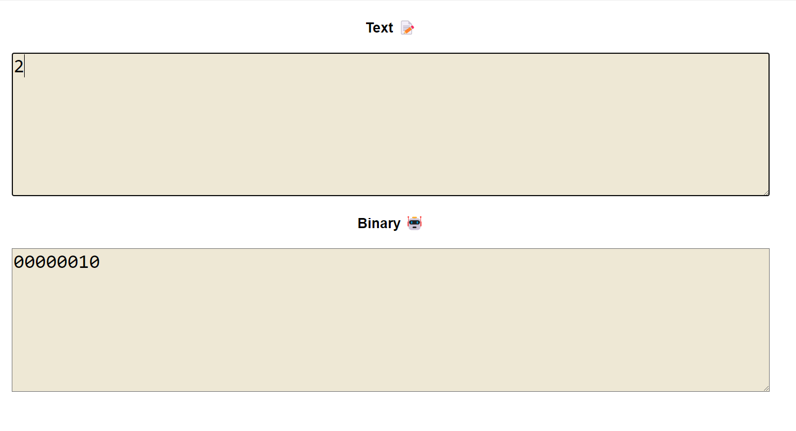

# Text2Binary Converter

## Description

The Text to Binary Converter is a JavaScript-based tool that allows users to input any text or decimal number and converts it into its binary representation. The tool supports both text (including letters, numbers, and special characters) and decimal numbers, providing a quick and easy way to see how data is represented in binary format.


## Main Features

1. Text Input: Converts each character of the input text into its corresponding ASCII binary code.


- Example:
```
Hi! => 01001000 01101001 00100001
H => 72 => 01001000
i => 105 => 01101001
! => 33 => 00100001
```

2. Decimal Number Input: Converts a decimal number directly into its binary form.


* Number => Binary code Without Converting to ASCII



- Example:
```
Decimal(NOT ASCII to Binary) => Binary
2 => 00000010
3 => 00000011
```

## Conclusion
I hope this program that help you in your business or task
Inshaallah I am going to improve it as soon as possible.

Try website: https://mustafashehata.github.io/text2binary/